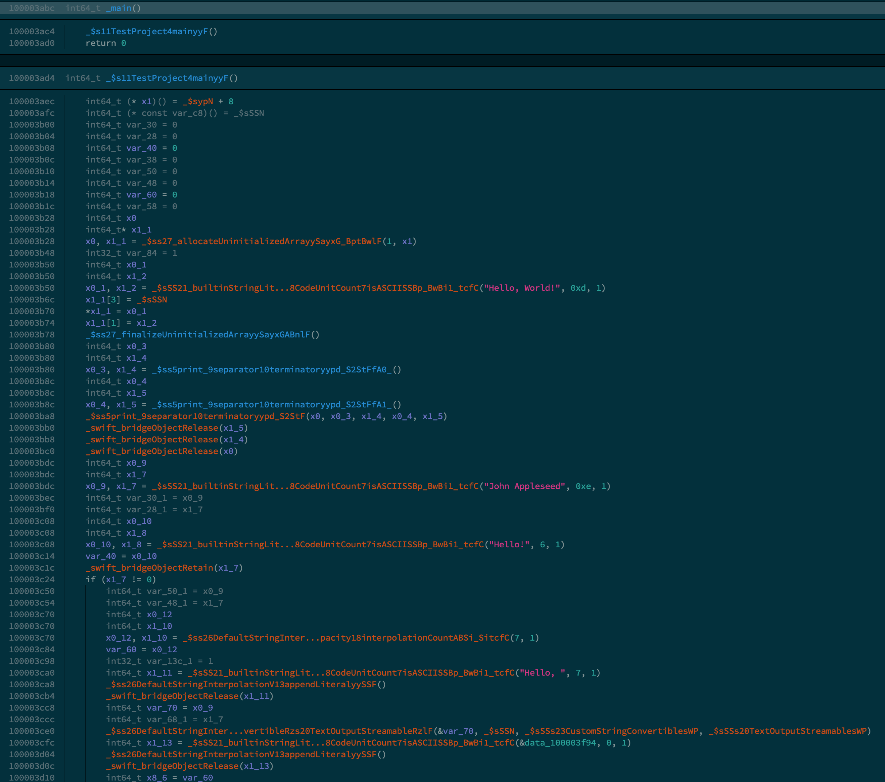
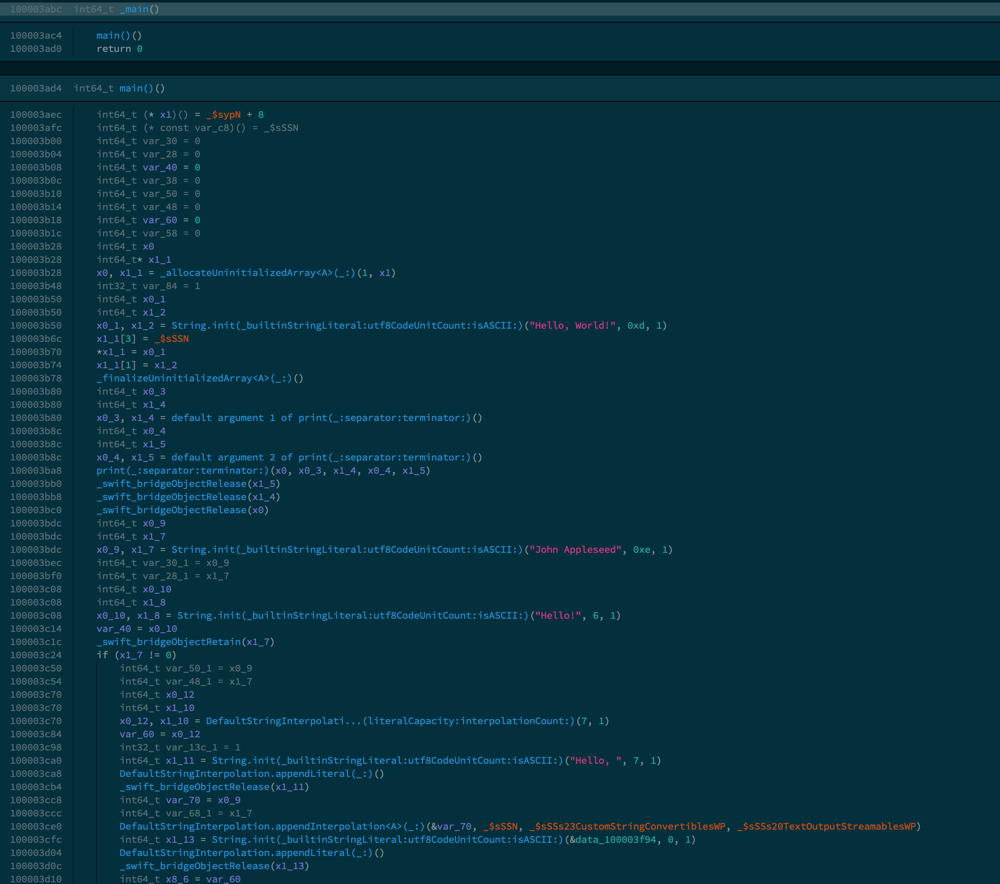

# bn-swift-demangle
Binary Ninja Plugin for demangling Swift function names. You need to have swift installed and in your PATH. Relies on the work of the Ghidra Swift demangler plugin by Thomas Roth (https://github.com/ghidraninja/ghidra_scripts/blob/master/swift_demangler.py).

## Example
Before:

After demangling:
